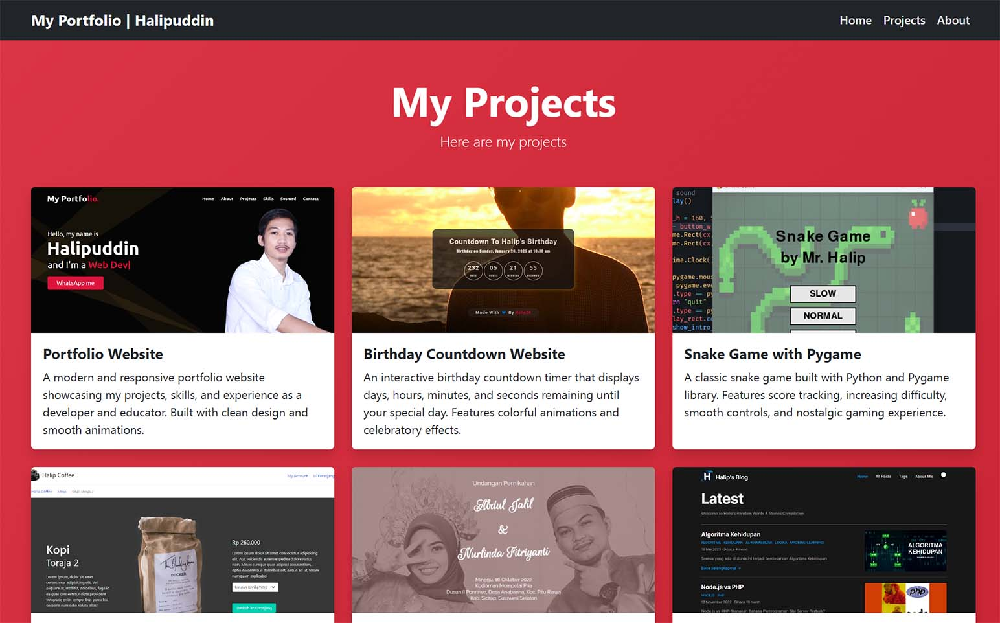

# 🚀 Portfolio Website - Halipuddin

A modern, responsive portfolio website showcasing my projects, skills, and experience as a Frontend Developer and Coding Educator.



## 🌟 Features

- **Responsive Design** - Fully responsive layout that works seamlessly on desktop, tablet, and mobile devices
- **Modern UI/UX** - Clean and professional design built with Bootstrap 5.3.2
- **Sticky Navigation** - Dark-themed navbar with smooth scrolling and active section highlighting
- **Interactive Project Cards** - Hover effects with scale animation and direct links to GitHub repositories
- **About Section** - Professional profile with detailed bio and experience
- **SEO Optimized** - Comprehensive meta tags for search engines and social media sharing
- **Social Media Ready** - Open Graph and Twitter Card support for rich previews on WhatsApp, Facebook, LinkedIn, and Twitter/X
- **Smooth Animations** - CSS transitions and JavaScript-powered scroll animations
- **Dynamic Footer** - Auto-updating copyright year with styled links

## 📂 Project Structure

```
portfolio-website/
├── assets/
│   ├── css/
│   │   └── style.css          # Custom styles and animations
│   ├── images/
│   │   ├── 1.png - 6.png      # Project screenshots
│   │   ├── avatar.jpg         # Profile picture
│   │   └── preview.jpg        # Website preview
│   └── js/
│       └── script.js          # Interactive features and animations
├── index.html                  # Main HTML file
├── README.md                   # Project documentation
├── LICENSE                     # MIT License
└── .gitignore                 # Git ignore file
```

## 🛠️ Technologies Used

- **HTML5** - Semantic markup
- **CSS3** - Custom styling with animations
- **Bootstrap 5.3.2** - Responsive framework
- **JavaScript (ES6)** - Interactive features
- **Git** - Version control

## 🎨 Sections

### 1. Navigation Bar

- Brand logo with name
- Responsive burger menu for mobile
- Smooth scroll navigation links (Home, Projects, About)
- Dark background theme

### 2. Projects Section

- 6 interactive project cards with hover effects
- Each card includes:
  - Project image
  - Title and description
  - Clickable link to GitHub repository
- Red gradient background

### 3. About Section

- Circular profile image with white border
- Professional title and role
- Detailed biography
- Grey background for contrast

### 4. Footer

- Dynamic copyright year (auto-updates)
- Personal website link with hover effects
- Dark theme matching navbar

## 🚀 Quick Start

1. **Clone the repository**

   ```bash
   git clone https://github.com/halip26/portfolio-website.git
   ```

2. **Navigate to project directory**

   ```bash
   cd portfolio-website
   ```

3. **Open in browser**

   ```bash
   # Simply open index.html in your preferred browser
   # Or use a local server:
   npx serve
   # or
   python -m http.server 8000
   ```

4. **Customize**
   - Update project information in `index.html`
   - Replace images in `assets/images/`
   - Modify styles in `assets/css/style.css`
   - Update GitHub repository links

## 📝 Customization Guide

### Update Personal Information

Edit `index.html` and update:

- Navigation brand name
- Project titles and descriptions
- GitHub repository links
- About section bio
- Footer links

### Change Colors

Edit `assets/css/style.css`:

- Navbar: `.navbar-dark .bg-dark`
- Projects section: `#projects` background gradient
- Footer links: `.footer-link` color (currently crimson)

### Add More Projects

Copy a project card `<div class="col-md-6 col-lg-4">` block in `index.html` and update:

- Image source
- Title and description
- GitHub link

### Update SEO Meta Tags

Edit the `<head>` section in `index.html`:

- `og:image` - Your hosted image URL
- `og:url` - Your website URL
- `twitter:creator` - Your Twitter/X handle

## 🌐 Browser Support

- ✅ Chrome (latest)
- ✅ Firefox (latest)
- ✅ Safari (latest)
- ✅ Edge (latest)
- ✅ Opera (latest)
- ✅ Mobile browsers (iOS Safari, Chrome Mobile)

## 📱 Responsive Breakpoints

- **Desktop**: 1200px and above
- **Tablet**: 768px - 1199px
- **Mobile**: Below 768px

## 🎯 Key Features Implementation

### Smooth Scrolling

```css
html {
  scroll-behavior: smooth;
}
```

### Card Hover Effect

```css
.card:hover {
  transform: scale(1.08) translateY(-5px);
  box-shadow: 0 15px 40px rgba(0, 0, 0, 0.4);
}
```

### Dynamic Year Update

```javascript
const currentYear = new Date().getFullYear();
document.getElementById('currentYear').textContent = currentYear;
```

## 📄 License

This project is licensed under the MIT License - see the [LICENSE](LICENSE) file for details.

## 👤 Author

**Halipuddin**

- Website: [halip26.github.io](https://halip26.github.io/)
- GitHub: [@halip26](https://github.com/halip26)
- Role: Frontend Developer | Data Engineer | Coding Educator
- Location: Makassar, Indonesia

## 🤝 Contributing

Contributions, issues, and feature requests are welcome! Feel free to check the issues page.

## ⭐ Show Your Support

Give a ⭐️ if you like this project!

## 📸 Screenshots

### Desktop View


### Projects Section

Interactive cards with hover effects and direct GitHub links

### About Section

Professional profile with detailed experience and skills

---

**Made with 🤍 by Halipuddin** | © 2025 All rights reserved.
